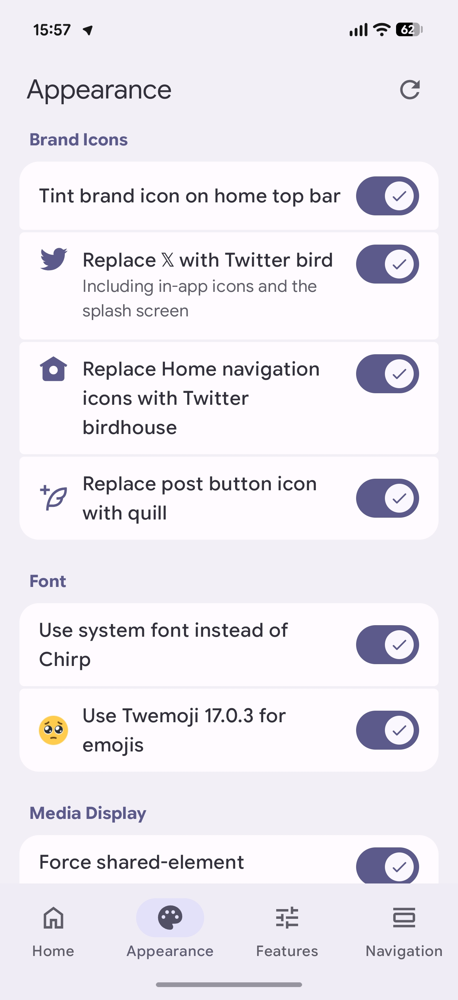
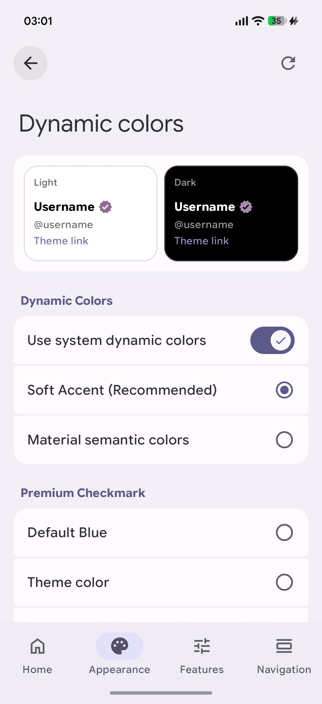
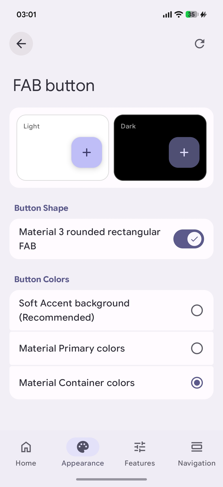
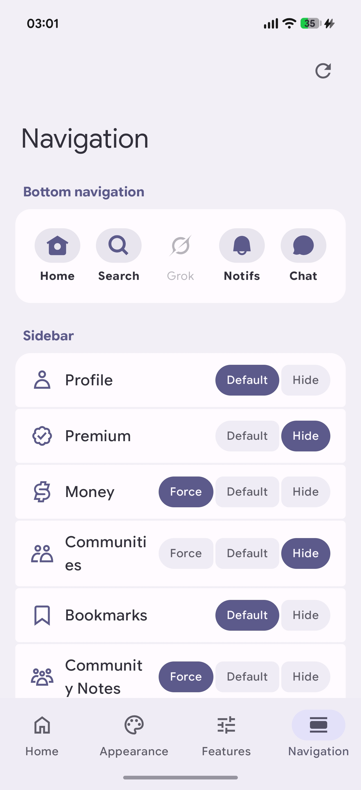
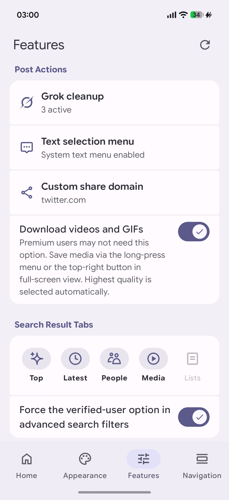

  <a href="README.md">English</a> · <a href="README_zh-CN.md">简体中文</a>

  

<h1 align="center">Re:X</h1>

  
  
  
  

  A brand-new LSPosed module for the New X Android app

> Re:X is closed source. This is its official project page, documentation, and release repository—the source isn't here; it's on my computer.

## Preview

Preview screenshots

<table>
  <tr>
    <td width="50%" align="center">
       
      <strong>Timeline & restored branding</strong> 
      Dynamic colors, the Twitter bird, birdhouse Home icon, M3 FAB with La Pluma icon, a cleaner navigation bar, and cats
    </td>
    <td width="50%" align="center">
       
      <strong>Appearance & brand icons</strong> 
      System font, Twemoji 17.0.3, brand icons, media presentation, and 🥺
    </td>
  </tr>
  <tr>
    <td width="50%" align="center">
       
      <strong>Dynamic colors</strong> 
      Colors derived from your system wallpaper, Soft Accent, Material semantic colors, and a blue check that doesn't necessarily have to be blue
    </td>
    <td width="50%" align="center">
       
      <strong>FAB button</strong> 
      Show/hide, Material 3 rounded rectangle with configurable color schemes
    </td>
  </tr>
  <tr>
    <td width="50%" align="center">
       
      <strong>Navigation & layout</strong> 
      Freely add or remove bottom navigation and drawer items
    </td>
    <td width="50%" align="center">
       
      <strong>Features & enhancements</strong> 
      Grok cleanup, custom share domains, media downloads, post actions, and search result tab controls
    </td>
  </tr>
</table>

## Features

### Appearance & UI

- Use system dynamic colors for the app theme, with optional Soft Accent and Material semantic color modes.
- Make the standard Premium blue check follow the primary or tertiary theme color.
- Configure separate splash screen color combinations for light and dark mode.
- Hide the compose FAB.
- Replace the circular compose FAB with a Material 3 rounded rectangle and choose from different Material color schemes.
- Choose between X's default in-app floating notification, the old wide solid-color UI, or the newer compact UI with a blurred background that X has not enabled yet.
- Independently choose the old, X default, or newer icon-based tab style for Home, profiles, Explore, and search details.
- Tint the brand icon at the top of Home with the theme color, as old Twitter did, instead of rendering it in black or white.
- Replace the 𝕏 logo with the Twitter bird.
- Replace the Home navigation icon with the birdhouse icon.
- Replace the post FAB button icon with the quill icon.
- Use the system font instead of Chirp.
- Use Twemoji like the web app and old Twitter.
- Force shared-element transitions when opening images.
- Enable a horizontal carousel for multi-image posts.

### Navigation & layout

- Freely show or hide Home, Explore, Grok, Notifications, and Chat in the bottom navigation bar.
- Set main and footer drawer items to follow X, always show where supported, or hide.
- Customize the width of the drawer (side menu).
- Add a Re:X settings entry to X's drawer.

### Timeline, search & profiles

- Hide promoted content in timelines and post replies.
- Hide the live Spaces bar at the top of the timeline.
- Hide the floating new-posts prompt at the top of the timeline.
- Hide the Upgrade to Premium button in the Home top bar.
- Prevent the Home timeline from refreshing automatically when the app starts or tab is switched.
- Remember and restore the last tab when the app starts.
- Remember and restore the last scroll position in the timeline when the app starts.
- Set profile media tabs to a single Media tab, separate Photos and Videos tabs, or a combined tab that opens to a chosen media type by default.
- Remove the standalone Reposts tab and return reposts to the Posts tab.
- Split Posts and Highlights.
- Hide the Subscriptions and Articles tabs.
- Undo the new oversized single-row layout for major actions such as Unfollow and Message.
- Hide the paid Subscribe button.
- Switch between the Android system photo picker and X's built-in post media picker.
- Choose which Top, Latest, People, Media, and Lists tabs appear in search results.
- Force the verified-users option to appear in advanced search filters.

### Posts, sharing & media

- Download videos and GIFs from the media long-press menu or fullscreen viewer; the highest available quality is selected automatically.
- Remove the “Ask Grok” and “Hide” items from the text selection menu.
- Add system Share, Translate, Define, and Process Text actions to the text selection menu, each configurable as shown directly, collapsed, or hidden.
- Replace share link domains with `twitter.com`, `fixupx.com`, `fxtwitter.com`, `xfixup.com`, or a custom domain.
- Hide the Grok button on post cards.
- Hide the Grok item in the image long-press menu.
- Hide the Grok button in the post detail toolbar.
- Independently manage the `Reply`, `Repost`, `Like`, `Dislike`, `Views`, `Bookmark`, and `Share` action buttons below timeline posts, the main post on the detail screen, and replies on the detail screen.

### Other features

- Browse and override Boolean Feature Switches collected from the currently supported X version.
- Back up and restore settings.

## Where does the “Re” come in?

After Hachidori stopped being maintained, I never found another LSPosed solution that really fit the way I use X. The `Re` is basically about picking up where this kind of module left off and starting fresh at the same time. Re:X is built from the ground up specifically for the refactored X Android interface.

It started simply because I couldn't stand that Premium users on iOS could customize their navigation bar while Android users still couldn't, so I added it myself. I'll probably keep adding things I personally want to change, and I want the module's own settings UI to feel pleasant too.

## Compatibility

| Requirement    | Supported / tested                                                                          |
| -------------- | ------------------------------------------------------------------------------------------- |
| Android        | Android 12 or later (API 31+)                                                               |
| Root           | Required                                                                                    |
| Framework      | A recent LSPosed build, or another compatible framework providing Modern Xposed API 101–102 |
| Target package | X for Android — `com.twitter.android`                                                       |
| Current target | X 12.15.0-beta                                                                              |
| Tested with    | X 12.14.0-release, X 12.13.0-release                                                                           |

Re:X only targets the redesigned X interface introduced in 2026. The older pre-rewrite interface and legacy mode are not supported.

Re:X is adapted for specific X versions. After an X update, individual hooks may temporarily stop working when obfuscated structures change. Other versions use feature-based fallback matching where possible, but compatibility is not guaranteed.

## Updates, discussion & feedback

- **Stable releases:** [GitHub Releases](https://github.com/Xposed-Modules-Repo/one.dot.rex/releases)
- **LSPosed:** [LSPosed Modules Repository](https://modules.lsposed.org/)
- **Updates, discussion, feedback & suggestions:** [Telegram group](https://t.me/re_x_mod)
- **Developer:** [1Dot on GitHub](https://github.com/1-dot) · [Coolapk profile](https://www.coolapk.com/u/1414025)

When reporting a compatibility issue, please include your Re:X version, X version, and the specific option that stopped working.

## Support Re:X

Re:X is free to use. If it makes scrolling X a little nicer, you can [support 1Dot on Ko-fi](https://ko-fi.com/1dot).

## Distribution

If you'd like to share Re:X, please share the official project page, Releases, LSPosed page, or Telegram group instead of re-uploading the APK.

See [TERMS.md](TERMS.md) for the rest of the distribution and modification guidelines.

## Notes & credits

Re:X is an independent third-party project. It is not affiliated with, endorsed by, or authorized by X Corp.

- [jdecked/twemoji v17.0.3](https://github.com/jdecked/twemoji/tree/v17.0.3): Twemoji graphics bundled with Re:X, used under CC BY 4.0. See [THIRD_PARTY_NOTICES.md](THIRD_PARTY_NOTICES.md) for details.
- Developed and maintained by [1Dot](https://github.com/1-dot).
