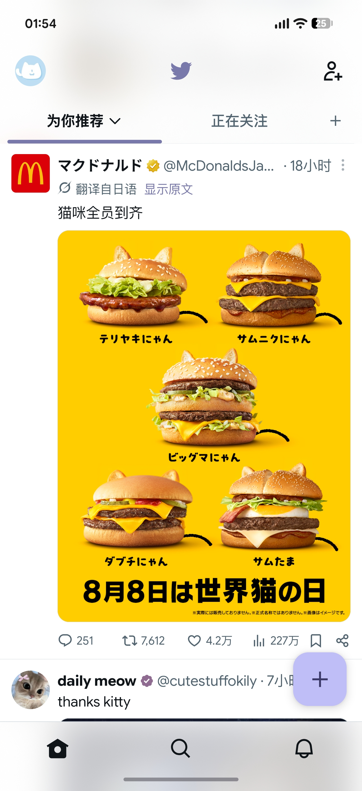

  <a href="README.md">English</a> · <a href="README_zh-CN.md">简体中文</a>

  

<h1 align="center">Re:X</h1>

  
  
  
  
  
  

  面向新版 X Android 客户端的全新 LSPosed 模块

> Re:X 是闭源项目。这里是它的官方介绍、文档与发布仓库——源码不在这里，源码在我电脑里。

## 部分预览

<table>
  <tr>
    <td width="50%" align="center">
       
      <strong>信息流与品牌元素恢复</strong> 
      动态取色、Twitter 小鸟、鸟舍主页图标、M3 FAB、精简导航栏，以及猫
    </td>
    <td width="50%" align="center">
       
      <strong>外观与品牌图标</strong> 
      系统字体、Twemoji 17.0.3、品牌图标、媒体展示，以及 🥺
    </td>
  </tr>
  <tr>
    <td width="50%" align="center">
       
      <strong>动态取色</strong> 
      系统壁纸配色、柔和 Accent、Material 语义色，以及也不一定是蓝色的蓝勾
    </td>
    <td width="50%" align="center">
       
      <strong>FAB 按钮</strong> 
      Material 3 圆角矩形与配色方案控制
    </td>
  </tr>
  <tr>
    <td width="50%" align="center">
       
      <strong>导航与布局</strong> 
      底部导航栏与侧边栏项目自由增减
    </td>
    <td width="50%" align="center">
       
      <strong>功能与增强</strong> 
      净化 Grok、自定义分享域名、媒体下载与搜索结果 Tab 控制
    </td>
  </tr>
</table>

## 功能

### 外观与界面

- 主题色使用系统动态取色，可选柔和 Accent 或 Material 语义色模式。
- 让普通 Premium 认证蓝勾跟随主色或第三主题色。
- 分别设置浅色、深色模式的 Splash 启动界面配色组合。
- 将圆形发帖 FAB 改为 Material 3 圆角矩形，并选择不同 Material 配色方案。
- 为应用内悬浮通知选择 X 默认、旧版纯色宽 UI 或未启用的新版模糊背景小 UI。
- 分别为主页、用户主页、探索页和搜索详情页选择旧版、X 默认或新版带图标 Tab 样式。
- 让主页顶部品牌图标像旧版 Twitter 一样使用主题色而不是黑白着色。
- 用 Twitter 小鸟替换 𝕏 标识。
- 用鸟舍图标替换导航栏主页图标。
- 使用系统字体替代 Chirp。
- 使用类似网页版和旧 Twitter 的 Twemoji 表情。
- 强制图片打开时使用共享元素过渡动画。
- 为多图帖子启用水平轮播组件。

### 导航与布局

- 自由显示或隐藏底部导航栏的首页、探索、Grok、通知、聊天。
- 为侧边栏主体与页脚项目选择跟随 X、强制显示（支持的项目）或隐藏。
- 在 X 侧边栏加入 Re:X 设置入口。

### 信息流、搜索与用户主页

- 隐藏信息流和帖子回复中的推广内容。
- 隐藏信息流顶部的直播空间栏。
- 隐藏信息流顶部的新帖悬浮提示。
- 阻止首页信息流在应用启动等情况下自动刷新。
- 启动应用时记忆并恢复上次在信息流中的滚动位置。
- 将用户主页媒体 Tab 行为设为单个媒体 Tab、分离的照片/视频 Tab，或默认显示指定类型的合并 Tab。
- 移除独立转发 Tab，恢复到帖子 Tab。
- 拆分帖子与亮点。
- 隐藏订阅 Tab 与文章 Tab。
- 取消关注、私信等大操作按钮的新版巨大单行样式。
- 隐藏付费订阅按钮。
- 在 Android 系统图片选择器与 X 内置发帖媒体选择器之间切换。
- 选择搜索结果中的热门、最新、用户、媒体和列表 Tab。
- 在高级搜索筛选器中强制显示认证用户选项。

### 帖子、分享与媒体

- 从媒体长按菜单或全屏查看器下载视频与 GIF；自动选择可用的最高画质。
- 净化文本选择菜单中的“问 Grok”和“隐藏”项。
- 可在文本选择菜单加入系统分享、翻译、词典和处理文本操作，并分别设为外显、折叠或隐藏。
- 将分享链接域名替换为 `twitter.com`、`fixupx.com`、`fxtwitter.com`、`xfixup.com` 或自定义域名。
- 隐藏帖子卡片中的 Grok 按钮。
- 隐藏图片长按菜单中的 Grok 项。
- 隐藏帖子详情页顶栏的 Grok 按钮。

### 实验功能

- 浏览并覆盖当前适配版本中整理出的布尔 Feature Switch。

结果可能受 X 版本、账号灰度和服务端配置影响。

## 哪里 Re 了

Hachidori 停止维护以后，我一直没找到一个很合自己习惯的同类 LSPosed 方案。比起另外维护一份 Patch 过的客户端，还是更喜欢让官方 X 照常从 Play 商店更新，再由 LSPosed 在运行时完成修改。

最开始只是因为受不了 iOS 端 Premium 用户能自定义导航栏，Android 却到现在没有，于是补了一个。之后大概也会继续加点自己想改的小东西，我也希望模块自身的设置 UI 足够舒服顺手。

## 兼容性

| 要求      | 支持 / 测试状态                                     |
| ------- | --------------------------------------------- |
| Android | Android 12 或更高版本（API 31+）                     |
| Root    | 必需                                            |
| 框架      | 新版 LSPosed，或其它提供 Modern Xposed API 101–102 的兼容框架 |
| 目标包名    | X Android 客户端 — `com.twitter.android`         |
| 当前适配目标  | X 12.15.0-beta                                |
| 已测试兼容   | X 12.14.0-release                             |

Re:X 仅面向 2026 年重写后的新版 X 界面，不支持重构前的旧版界面或旧模式。

Re:X 会针对具体 X 版本适配。更新 X 后，部分 Hook 可能因混淆结构变化暂时失效；其它版本会尽可能通过特征匹配兜底，但不保证兼容。

## 安装与设置

1. 准备已 Root、运行 Android 12 或更高版本，并安装兼容 LSPosed 框架的设备。
2. 安装受支持的官方 X Android 客户端。
3. 从 [官方 GitHub Releases](https://github.com/Xposed-Modules-Repo/one.dot.rex/releases) 或 Telegram 群组下载 Re:X APK。
4. 安装 Re:X，在 LSPosed 中启用模块，并选择 **X**（`com.twitter.android`）作为作用域。
5. 重新启动 X。
6. 通过 Re:X 桌面图标或 LSPosed 模块设置入口打开设置。

Re:X 不需要修改或分发预先 Patch 的 X APK。

设置会立即保存；大部分 Hook 会在 X 进程启动时读取配置，因此修改后请重新启动 X。Re:X 内置了 Root **重启 X** 操作。

你也可以在 **导航 → 侧边栏页脚** 中加入 X 内的 Re:X 设置入口，再按需隐藏桌面图标。

### 可选：系统界面作用域

自定义 X 开屏配色需要额外启用 `com.android.systemui` 作用域。

如果该功能没有生效，请启用该作用域并重启一次系统界面。其它功能通常不需要 System UI 作用域。

## 更新、交流与反馈

- **正式版本：** [GitHub Releases](https://github.com/Xposed-Modules-Repo/one.dot.rex/releases)
- **LSPosed：** [LSPosed Modules Repository](https://modules.lsposed.org/)
- **更新、讨论、反馈与建议：** [Telegram 群组](https://t.me/re_x_mod)
- **开发者：** [1Dot 的 GitHub](https://github.com/1-dot) · [酷安主页](https://www.coolapk.com/u/1414025)

反馈兼容性问题时，请尽量附上 Re:X 版本、X 版本、Android 版本和具体失效的选项。

## 支持 Re:X

Re:X 免费使用。如果它让刷推舒服了一点，欢迎前往 [Ko-fi 支持 1Dot](https://ko-fi.com/1dot)，或者在应用里的「支持」中找到微信赞赏码和支付宝收款码。

不投喂也没事，继续用就好（

  

## 分发

如果想分享 Re:X，欢迎分享官方项目页、Release、LSPosed 页面或 Telegram 群组链接，不要重新上传 APK，也尽量不要在 X 平台集中宣传。

其它分发与修改说明见 [TERMS_zh-CN.md](TERMS_zh-CN.md)。

## 说明与致谢

Re:X 是独立第三方项目，与 X Corp. 无关联，也未获得其认可或授权。

- [jdecked/twemoji v17.0.3](https://github.com/jdecked/twemoji/tree/v17.0.3)：Re:X 内置的 Twemoji 图形资源，按 CC BY 4.0 使用。详见 [THIRD_PARTY_NOTICES.md](THIRD_PARTY_NOTICES.md)。
- 由 [1Dot](https://github.com/1-dot) 开发与维护。
